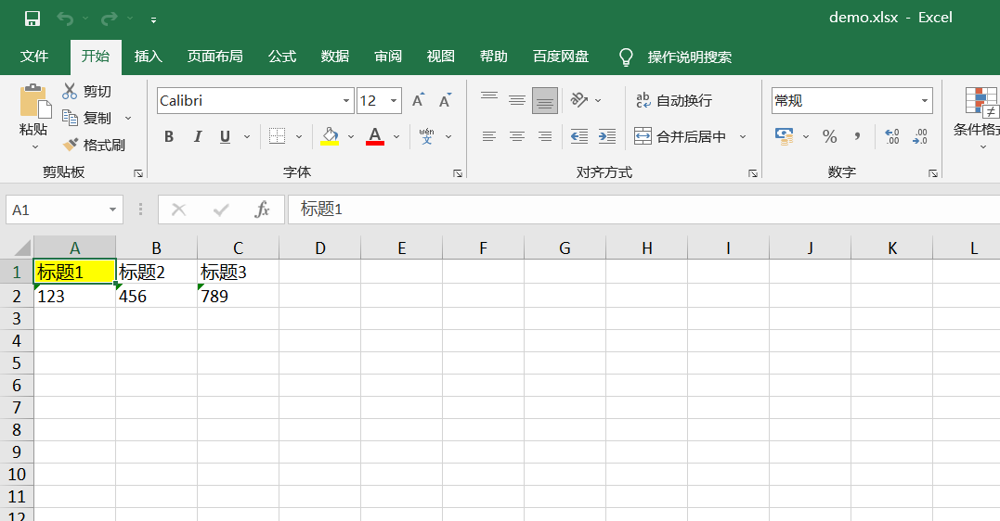

## 整合[sheetjs](https://github.com/SheetJS/js-xlsx)和[xlsx-style](https://github.com/protobi/js-xlsx)导出自定义样式Excel的示例代码

### 文件描述

 ./libs/xlsx.core.min.js

[sheetjs](https://github.com/SheetJS/js-xlsx)核心文件，对应来自 sheetjs项目/dist/xlsx.core.min.js

 ./libs/xlsx.style.min.js

[xlsx-style](https://github.com/protobi/js-xlsx)核心文件，对应来自 xlsx-style项目/dist/xlsx.full.min.js。由于xlsx.full.min.js对外暴露变量XLSX和xlsx.core.min.js冲突，所以将xlsx.full.min.js中的XLSX变量名改为XlsxStyle。

### 导出Excel效果图



### ARGB转换16进制工具

详见./tool/ARGBHexConverter2.zip

### 使用

```
<script src="./libs/xlsx.core.min.js"></script>
<script src="./libs/xlsx.style.min.js"></script>
<script type="text/javascript">
    ((win,doc) => {

        function str_to_array_buffer(str){
            let buf = new ArrayBuffer(str.length);
            let view = new Uint8Array(buf);
            for (let i=0;i!==str.length;++i) view[i] = str.charCodeAt(i) & 0xFF;
            return buf;
        }

        // 设置数据
        let wb = {
            SheetNames: ["sheet1"],
            Sheets: {},
        };
        let data = [
            ["标题1","标题2","标题3"],
            ["123","456","789"]
        ];
        let ws = XLSX.utils.aoa_to_sheet(data);

        // 设置样式
        ws["A1"].s = {
            fill: { fgColor: { rgb: 'FFFFFF00' } }
        };
        wb.Sheets["sheet1"] = ws;

        // 导出保存
        let wopts = {bookType: 'xlsx',bookSST: false,type: 'binary'};
        let wbout = XlsxStyle.write(wb, wopts);
        let blob = new Blob([str_to_array_buffer(wbout)], {type:"application/octet-stream"});
        let url = window.URL.createObjectURL(blob);

        let link = doc.createElement('a');
        let body = doc.querySelector('body');
        link.href = url;
        link.download = "test123.xlsx";

        // fix Firefox
        link.style.display = 'none';
        body.appendChild(link);
        link.click();
        body.removeChild(link);
        win.URL.revokeObjectURL(link.href);

    })(window,document);
</script>
```

